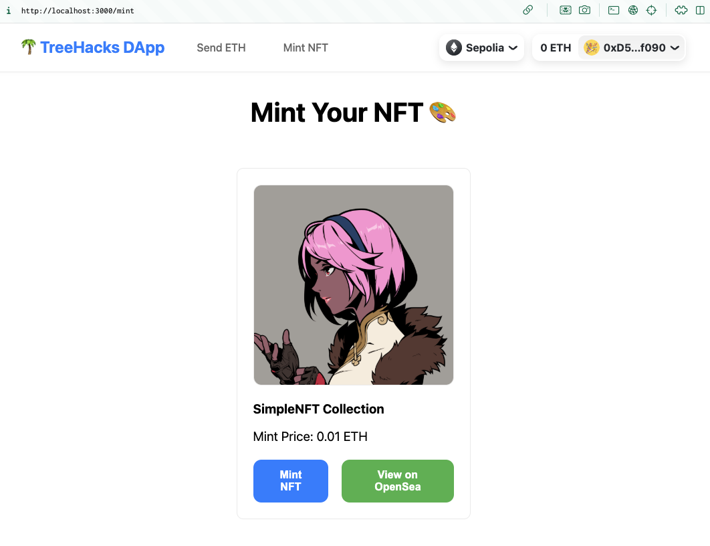

# TreeHouse SDK

By Jay Yu and Josh Koo

A framework for one-click deployment of Web3 applications on Ethereum. Built for the TreeHacks Web3 Workshop!

## Project Overview



The DApp SDK consists of two main components:
- A frontend application for ETH transfers and NFT minting, built with Next.js, Wagmi, and RainbowKit to interact with the smart contracts
- Backend smart contracts using Hardhat, including a basic ERC721 NFT deployer contract, and the default Hardhat Lock contract

## Prerequisites
- Node.js 18+ installed (Suggested `nvm use 20`).
  - We recommend using Node Version Manager [nvm](https://github.com/nvm-sh/nvm) to manage your Node.js versions.
  - You can install nvm via:
  `curl -o- https://raw.githubusercontent.com/nvm-sh/nvm/v0.40.1/install.sh | bash`.
  - Once you have `nvm` installed, you can run `nvm install 20` to install Node.js 20.
- MetaMask or another Web3 wallet with Sepolia testnet access where you have access to a private key (we need this in Part 4).
  - You can download MetaMask as a Chrome extension [here](https://metamask.io/download/).
- Some Sepolia testnet ETH from a faucet, such as Google Cloud's [Sepolia Faucet](https://cloud.google.com/application/web3/faucet/ethereum/sepolia)


## Quick Start

1. Clone this repository
```bash
git clone https://github.com/Stanford-Blockchain-Club/treehouse-sdk
```

2. Install dependencies in both backend and frontend directories:
```bash
cd backend && npm install
cd ../frontend && npm install
```

3. Run the frontend on `localhost:3000`:
```bash
npm run dev
```
You can see the frontend by going to `localhost:3000` in your browser.

4. Test the backend smart contracts in a seperate terminal:
```bash
cd backend && npx hardhat test
```

### Features

The deployed application (accessible at `localhost:3000`) has several basic features of a web3 application:
1. Wallet connection using RainbowKit, that automatically connects to the Ethereum Sepolia testnet (supporting MetaMask, Coinbase etc.)
2. ETH transfer functionality on Ethereum's Sepolia testnet by entering an address and amount. This will ask the user to confirm a simple transaction in their wallet.
3. NFT minting capability, interacting with a Sepolia-deployed ERC721 contract (`SimpleNFT.sol`). This NFT contract clones Azuki's metadata format, and is viewable on Opensea.

Surprisingly, even for such a seemingly trivial web3 application, you need a whole lot of infrastructure to get it working, including:
- Next.js frontend
- Wagmi to interact with the Ethereum blockchain
- RainbowKit to connect wallets
- Hardhat to deploy and test smart contracts
- Sepolia testnet RPC URL from Infura or Alchemy to connect to the Ethereum network
- Sepolia ETH to pay for gas fees

## How does it work?

See documentation and guides in the `docs` folder:
- Part 1: [Anatomy of an Ethereum DApp](docs/1-intro.md)
- Part 2: [Frontend TypeScript Stack](docs/2-frontend.md)
- Part 3: [Backend Smart Contract Stack](docs/3-backend.md)
- Part 4: [Deploying Smart Contracts (Local and Sepolia Testnet)](docs/4-deploy.md)
- Part 5: [NFT Metadata and Standards](docs/5-nft-metadata.md)


## Project Structure
```
treehacks-dapp/
├── backend/ # Smart contract & deployment code
| |
│ ├── contracts/ # Solidity smart contracts
│ │ ├── Lock.sol # Basic lock contract
│ │ └── SimpleNFTSale.sol # NFT contract
│ ├── scripts/ # Contract deployment scripts
│ ├── test/ # Contract test files
│ ├── ignition/ # Hardhat Ignition deployment modules
│ ├── hardhat.config.ts # Hardhat configuration
│ └── package.json # Backend dependencies
|
└── frontend/ # Next.js frontend application
    ├── src/
    │ ├── components/ # React components
    │ ├── pages/ # Next.js pages
    │ ├── styles/ # CSS modules
    │ └── wagmi.ts # Wagmi configuration
    └── package.json # Frontend dependencies
```


## Further Reading

- **TypeScript Frontend**
  - [Next.js](https://nextjs.org/) - React framework
  - [RainbowKit](https://rainbowkit.com) - Wallet connection
  - [wagmi](https://wagmi.sh) - Ethereum hooks
  - [Viem](https://viem.sh) - Ethereum utilities

- **Smart Contract Backend**
  - [Hardhat](https://hardhat.org) - Development environment
  - [OpenZeppelin](https://openzeppelin.com) - Contract libraries
  - [Ethers.js](https://docs.ethers.org) - Ethereum library

Suggested Exercises:
1. Modify the NFT contract to add your own features
2. Create a new page in the frontend
3. Add a new smart contract function
4. Customize the UI design


## Contributing

This is a workshop demonstration project. Feel free to fork and modify for your own learning purposes!

## License

MIT

