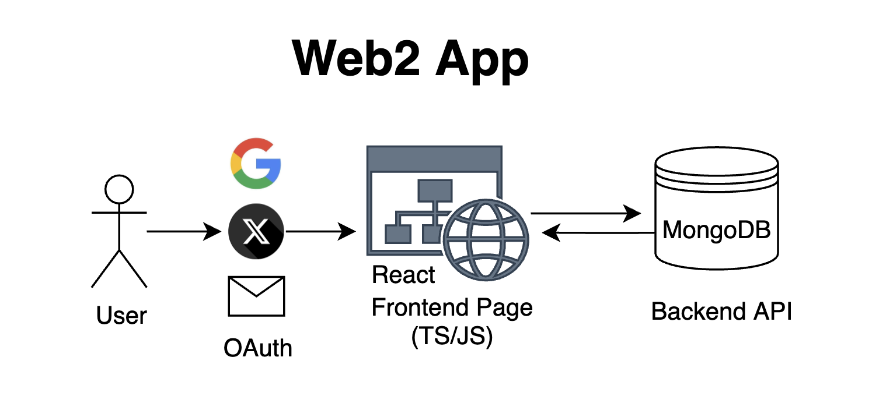

# Anatomy of an Ethereum DApp

## What is a DApp?

A DApp (Decentralized Application) is a software application that runs on a distributed computing system - typically a blockchain network like Ethereum. Unlike traditional web applications that run on centralized servers, DApps operate on a peer-to-peer network of computers.

Here's a contrast between the infrastructure of a traditional web application and a DApp:



A traditional web application has two main components - (1) a user-facing frontend and (2) a backend server API. To log in an application, the user might use an OAuth provider like Google or Facebook.


A DApp, on the other hand, has three main components - (1) a user-facing frontend, (2) a traditional API server (sometimes), and (3) a smart contract "backend" that runs on a blockchain network like Ethereum.

Instead of using OAuth providers to log in, a DApp uses a "wallet connector", such as RainbowKit, MetaMask, or Coinbase Wallet to log the user into the application.

The user can then interact with the application like a normal web application through the frontend and API server. However, if the user wants to interact with the blockchain "backend", they will need an RPC provider, which is a service that queries the blockchain and returns data to the user.

When we're simply reading data from the blockchain and sending transactions, we can use a library like Wagmi/Viem or ethers.js to handle all of the transactions for us. However, if we want to actually deploy and interact with smart contracts, we will need to use a tool like Hardhat, as well as manually find an RPC provider such as Alchemy or Infura to deploy and interact with our smart contracts.


## Project Structure

Because of this, a typicall DApp project will have a structure that looks like this:

```
treehouse-dapp/
├── backend/ # Smart contract & deployment code
| |
│ ├── contracts/ # Solidity smart contracts
│ │ ├── Lock.sol # Basic lock contract
│ │ └── SimpleNFTSale.sol # NFT contract
│ ├── scripts/ # Contract deployment scripts
│ ├── test/ # Contract test files
│ ├── ignition/ # Hardhat Ignition deployment modules
│ ├── hardhat.config.ts # Hardhat configuration
│ └── package.json # Backend dependencies
|
└── frontend/ # Next.js frontend application
    ├── src/
    │ ├── components/ # React components
    │ ├── pages/ # Next.js pages
    │ ├── styles/ # CSS modules
    │ └── wagmi.ts # Wagmi configuration
    └── package.json # Frontend dependencies
```

## Tech Stack

As of Feb 2025, one of the most popular tech stacks for building DApps is the following:

- **TypeScript Frontend**
  - Next.js - React framework
  - RainbowKit - Wallet connection
  - Wagmi - Ethereum hooks
  - Viem - Ethereum utilities

- **Smart Contract Backend**
  - Hardhat - Development environment
  - OpenZeppelin - Misc Contract libraries
  - Viem - Ethereum utilities and deployment
  - Infura - RPC provider

The blockchain space moves very quickly, and the tech stack used here is not set in stone. However, it is a good starting point for understanding how to build a DApp in the current landscape.

To learn more about the Frontend TypeScript Stack, see the [Part 2: Frontend TypeScript Stack](2-frontend.md)

To learn more about the Backend Smart Contract Stack, see the [Part 3: Backend Smart Contract Stack](3-backend.md)

To learn more about deploying smart contracts, see the [Part 4: Deploying Smart Contracts (Local and Sepolia Testnet)](4-deploy.md)


